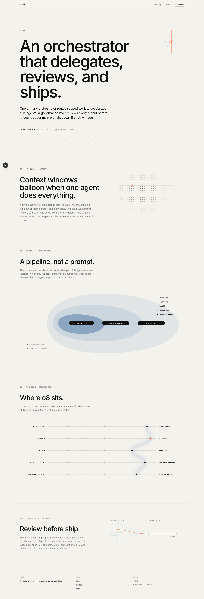

# o8

An orchestrator that delegates, reviews, and ships.

One primary orchestrator routes scoped work to specialized sub-agents. A governance layer reviews every output before it touches your main branch. Local-first. Any model.

---

## 00 — Preview



Product screenshots coming soon. Landing site source: [hurttlocker/o8-site](https://github.com/hurttlocker/o8-site).

## 01 — What this repo is

This is the **public development log** for o8. The engineering source is private; feature-grade commits sync here on every merge to main.

```
/
├── CHANGELOG.md   — what shipped, grouped by day
├── STATS.md       — rolling build velocity
└── assets/        — preview images
```

## 02 — (FEAT · PERF · DESIGN) only

The feed is filtered, not dumped. An entry makes the cut only if —

- The prefix is `feat:`, `perf:`, or `design:` (no `fix:` / `refactor:` / `chore:` noise)
- It landed in the last 180 days
- It passes a blocklist covering internal codenames, competitor mentions, architecture-level phrases, and strategy keywords
- A sed pass generalizes implementation specifics into product-level language

The sync workflow fails closed if anything slips past. Every entry here has been through that gate.

## 03 — Staying current

- Star the repo to follow new entries
- Watch the [CHANGELOG.md](./CHANGELOG.md) directly — it updates on every push to the private main

---

```
(o8)          An orchestrator that delegates, reviews, and ships.
(mirror)      hurttlocker/o8
(landing)     hurttlocker/o8-site
(build)       v0.1.7
```
