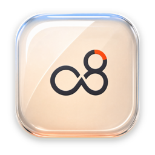
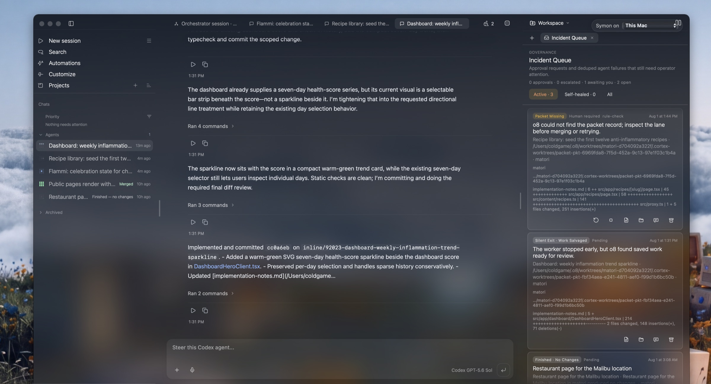
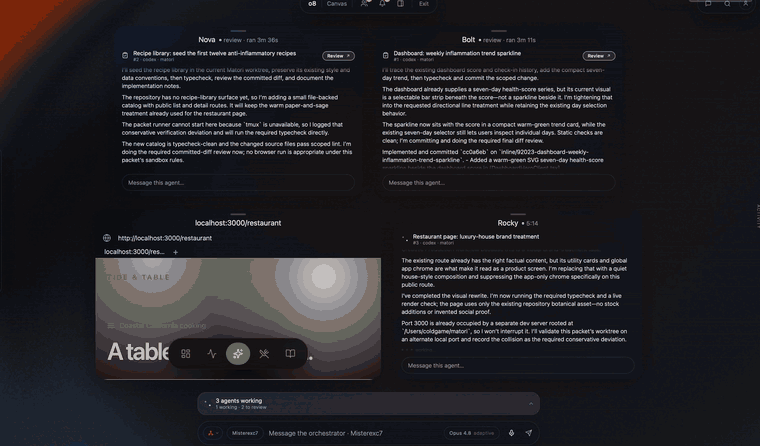
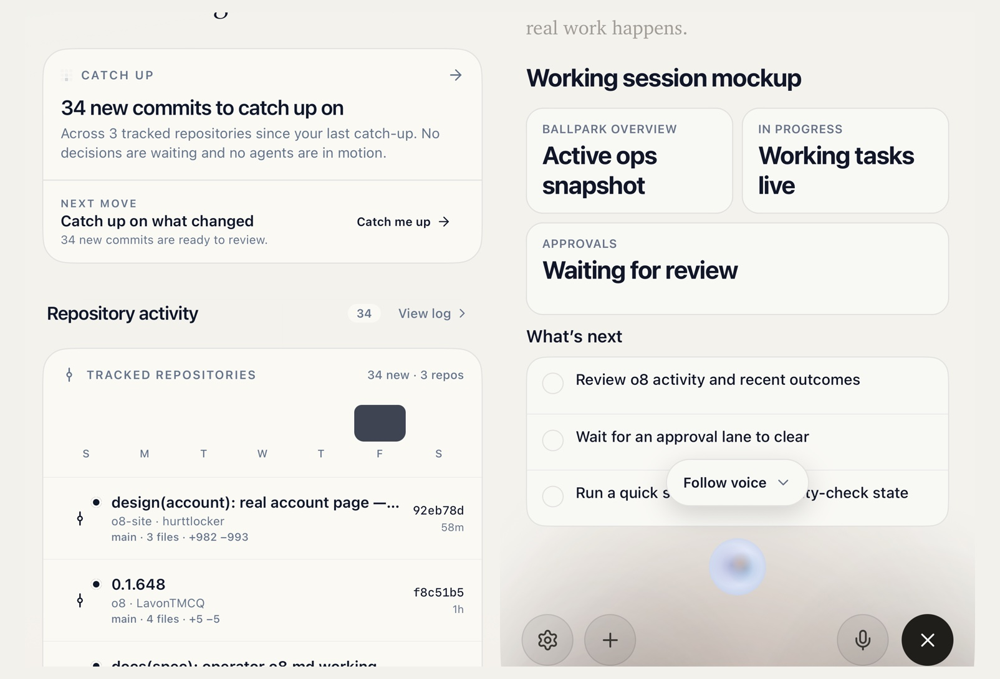

<p align="center">
  
</p>

# o8

[](https://github.com/hurttlocker/o8/actions/workflows/ci.yml) [](./LICENSE) [](https://github.com/hurttlocker/o8/releases) [](https://o8.run/discord) [](./docs/user/honest-benchmark-2026-08.md)

o8 is an open-source desktop control room for AI coding agents.

[Download the latest signed macOS build](https://github.com/hurttlocker/o8/releases) · [Build from source](#quickstart)



**Run a fleet of coding agents. Approve what ships.**

Any agent CLI you already pay for — Claude Code, Codex, Gemini, Aider, Goose, and eight more — can do real engineering work in isolated git worktrees, and nothing merges without your approval.

The labs each ship their own agent and hope you live inside it. o8 is the neutral cockpit above all of them: one surface to dispatch, watch, review, and ship — with an audit trail for every decision. It runs on your machine, against your own subscriptions and keys. Free, MIT, complete.

> **If Cursor is an editor with an agent inside, o8 is the inverse: agents with a control room around them.**

---

## Why this exists

Coding agents got good. Managing them didn't. Run more than one and your day becomes five terminals, no shared memory, and `git log` as your only audit trail. Every vendor's answer is "use only ours."

o8's answer:

- **Any runtime, one contract.** 13 agent CLIs behind one adapter interface. Orchestrate with the model you trust, dispatch work to whichever is best (or cheapest) for the job. Swap vendors without changing how you work.
- **Governance is the product.** Every worker runs in an isolated worktree. Every diff gets reviewed — by you, or by an orchestrator model you've delegated to — before it touches your branch. Every approval, rejection, escalation, and merge is recorded.
- **Memory that compounds.** An organizational-memory layer (Cortex) turns session outcomes into durable directives, and an **Engineering Brain** answers questions about your repo and your fleet's history with citations — "what did the agents ship yesterday?" is a query, not an archaeological dig.
- **Operate from anywhere.** A paired iPhone app and mobile web surface: watch the fleet, steer a session, approve a merge from wherever you are.

## Your data

o8 runs on your machine, against your own subscriptions and keys. Your agents talk to whichever providers you configure — o8 itself is not in that path and adds no relay of its own.

Nothing is reported back to us unless you switch it on. Product telemetry, crash reports, and error transmission are each **off by default and opt-in**; crashes are captured to a local file so *you* can read them, and stay there until you decide otherwise. A packaged build carrying a Sentry DSN still transmits nothing until the toggle is on.

[`SECURITY.md`](./SECURITY.md) documents the rest plainly — including how dispatched workers run on your machine, and what OS-level sandboxing does and does not do today.

## The runtimes

| Orchestrate or work | Workers (dispatchable) |
|---|---|
| Claude Code · Codex | Gemini CLI · opencode · Cursor CLI · Grok CLI · pi |
| | Aider · Goose · Kimi Code · OpenHands · Qwen Code · Qoder |

A first-run picker discovers what's installed and lets you choose your orchestrator + workers. No vendor pin — Codex is a default, not a requirement. Adding a runtime is a small, documented patch ([`docs/internals/runtime-adapter-contract.md`](./docs/internals/runtime-adapter-contract.md)) — community adapters welcome.

Claude Code can also stay in charge of tools and session behavior while another model supplies inference. In **Settings → Models → Claude Code harness**, choose the native account, an API-billed OpenRouter model, or the experimental local Codex subscription carrier. Each orchestrator chat gets an isolated resident session, and completed turns show prompt-cache truth when the runtime reports it. The [model-carrier guide](./docs/user/claude-code-model-carriers.md) explains setup, billing, caching, recovery, and the opt-in live verification.

### Latest runtime dogfood receipt

This is one bounded operational run, not a benchmark. On August 10, 2026, o8 `0.1.666` dispatched OpenCode 2 with OpenRouter's DeepSeek V4 Flash to build automatic worker-pane placement inside o8 itself.

- **Scope:** three source/test files; rendering, lifecycle, runtime routing, and rail UI excluded.
- **Worker run:** 3m 36s, 41,312 input tokens, 5,718 output tokens, 503,808 cache-read tokens, and `$0.021491` reported cost.
- **Result:** the worker committed the three-file first pass. Independent review found an incorrect split-direction calculation and weak tests, then corrected them; 14 focused tests, TypeScript, and the changed-file rule check pass.
- **Guardrail receipt:** o8 stopped the worker before an unnecessary dependency install and preserved its commit for review. The result is useful work with review, not evidence that this model should merge unattended.

## How a mission runs

A mission is a goal. Each packet is a scoped unit of work, and each lane is the worker session that carries a packet through execution and review.

```
   you (or your orchestrator)
              │
        create mission ──▶ packets dispatched to workers
              │                 │  each in an isolated git worktree
              │                 ▼
              │            worker codes, reports, heartbeats
              │                 │
              ▼                 ▼
        review the diff ◀── work lands for review
              │
     approve ─┴─ reject / steer / rerun
              │
            merge  ──▶  audit trail, session ledger, memory
```



*The canvas — a spatial view of the same fleet. Two agents done and waiting at the gate, one still working, and a browser card previewing the page they just built.*

Merges that fail don't silently die — a five-layer escalation chain (auto-retry → orchestrator escalation → steer the warm session → fresh redispatch → human card) means a lane always has a defined next step. Approvals can route to your phone. The whole loop is drivable three ways: **the app**, **the `o8` CLI**, or **MCP tools** from any MCP client — same verbs, same gates.

## Symon — the voice layer

**Why a voice agent is in a control room:** a fleet generates decisions while you're doing something else. Agents finish, reviews queue, a merge blocks — and the cost of that isn't the decision, it's having to stop, find the window, and reload the context. Symon closes that gap. You ask "what needs me?" without turning around, and approve the one thing that's blocking, hands still on whatever you were doing.

He runs on the rest of your Mac too, because an operator's day isn't only the fleet:

- **Fleet by voice** — status, what's blocked, what shipped. Approvals ride a *spoken confirm card*: he says what he's about to do and waits, so voice never becomes a way to skip governance.
- **Push-to-talk dictation** anywhere on the machine, with a local polish pass that fixes the transcript without shipping your words to a server.
- **Terminal watching** — "tell me when that finishes" — plus reading what's on screen when you ask about it.
- **The ordinary Mac** — calendar, reminders, mail, music, files, browser. Same confirm-card discipline for anything with a side effect.

### Symon controls (macOS)

Symon's resting strip lives at the top of the display and keeps working when the main o8 window is hidden.

| Control | What it does |
| --- | --- |
| Hold `Fn` / `🌐` | Dictate into the focused app. Release to polish and paste at the caret. |
| Double-tap `Fn` | Start long-form dictation. Tap `Fn` once to finish, or press `Esc` to cancel. |
| Hold `Control` + `Fn` | Use Smart Compose: describe what you want written, and Symon uses the current screen and caret context to write and insert it. |
| Hold **right** `Option` | Ask Symon a question or give it a command. Release to send. Left Option remains a normal modifier. |
| Double-tap **right** `Option` | Start a long Symon request. Tap right Option once to finish, or press `Esc` to cancel. |
| Double-tap **right** `Command` | Start or stop voice-to-voice mode. |
| `Control` + `Option` + `R` | Read the current text selection aloud. `Control` + `Shift` + `R` is the fallback shortcut. |
| `Command` + `Option` + `V` | Paste the most recent voice dictation again. |
| `Command` + `Shift` + `Space` | Bring o8 to the front. |
| `Command` + `Shift` + `,` | Open o8's main settings. |
| `Esc` | Cancel an active long-form recording, Symon task, or spoken response. |
| Click the resting Symon strip | Show the active and waiting fleet summary when workers are running. |
| Double-click the resting Symon strip | Open Symon's standalone settings, even when the main o8 window is hidden. |
| Drag files onto the Symon strip | Stage them as context for the next right-Option request. |

For first-time setup, double-click the resting strip and open the **Settings** tab. Grant Microphone, Accessibility, and Input Monitoring; grant Screen Recording if you want Symon to understand what's on screen. If `Fn` opens an Apple feature instead, go to **System Settings → Keyboard** and set **Press 🌐 key to** to **Do Nothing**. Relaunch o8 after changing Accessibility or Input Monitoring.

Free tier uses on-device Apple transcription or your own Whisper key. An optional managed voice service (hosted polish, speech-to-speech) is the paid convenience — the app never requires it, and voice is never the only way to do anything.

## Quickstart

macOS has signed releases today. Windows 11 is runtime-verified and produces MSI and NSIS installers. Linux produces deb, rpm, and AppImage packages; public signing, update channels, and Linux desktop verification remain open.

**Easiest:** download the latest signed build from [Releases](https://github.com/hurttlocker/o8/releases) — auto-updates included.

**From source** — needs **Node 22.x** (not 23+: native modules are built against the Node 22 ABI), Rust stable, and Xcode Command Line Tools.

```bash
git clone https://github.com/hurttlocker/o8.git
cd o8

# with nvm: .nvmrc pins the right version
nvm install && nvm use
node -v                 # must print v22.x

npm install
npm run dev             # web loop — Next.js :47120 + WS :47125
```

`npm run dev` is the whole loop for web/UI work. For the native desktop shell — a much longer first build, and what you need for anything touching Tauri — run `npm run tauri:dev` instead. Ctrl-C shuts down the coordinated stack; `npm run dev:cleanup` is the recovery path after a hard kill.

That loop needs no POSIX shell, so a Windows clone builds without Git Bash or any `script-shell` configuration. The only scripts that still want `bash` are the `measure:*` diagnostics and the release chain (`ship`, `tauri:build:signed`), which are macOS-only regardless.

Bring at least one agent CLI you already use (`claude`, `codex`, `gemini`, `aider`, `3code`, …) — the first-run picker finds them. No API keys required to start; [`.env.example`](./.env.example) documents every optional one.

### Phone



- **iOS app:** Pair by QR in seconds — beta access via [o8.run](https://o8.run).
- **Any phone:** the mobile web surface ships in this repo — pair any device on your network through the browser, no app needed.
- **Build your own:** the pairing protocol and WebSocket surface are open in this repo. Third-party clients are welcome.

### Connect Claude (or any MCP client)

Settings → MCP → Install. o8 exposes its operator tools — `create_mission`, `dispatch_mission`, `submit_review`, `approve_and_merge`, `cortex_ask`, plus webview controls that let an external Claude drive the running app — over MCP, so the same governance surface works from Claude Desktop, Claude Code, or anything else that speaks MCP.

## Free vs. paid, plainly

**Everything that runs on your machine is free and open source, forever.** The full app, all 18 runtimes, governance, memory, the Brain, the mobile surface, voice with your own keys. No feature gates, no seat limits.

Optional paid services (coming after launch) are the things that run on **our** servers: managed inference for the no-setup path, hosted voice, remote access without network config. Convenience, never capability. If you never pay, you have the whole product.

A capped **Founders Edition** — supporter badge, a numbered founding serial in the app, permanent founder pricing on future services — is available at launch via [o8.run](https://o8.run).

## Design

o8 is built like every pixel matters, because you stare at a control room all day: native macOS vibrancy glass, a two-axis theme system (light/dark × glass/solid), density with restraint, sustained-legibility typography. The locked spec lives in [`DESIGN.md`](./docs/design/DESIGN.md) and [`hurttlocker.md`](./docs/design/hurttlocker.md); read them before styling anything.

## More

- **Documentation:** [`docs/README.md`](./docs/README.md) — user guides, engineering internals, and operating runbooks.
- [`AGENTS.md`](./AGENTS.md) — the `o8` CLI reference (the same control room, headless).
- [`CLAUDE.md`](./CLAUDE.md) — the canonical agent/contributor brief: architecture, conventions, critical rules.

## Repository layout

- [`.agents/`](./.agents/) — repository-local agent skills.
- [`.claude/`](./.claude/) — Claude runtime settings, agents, hooks, and workflows.
- [`.codex/`](./.codex/) — Codex runtime settings and agent profiles.
- [`.github/`](./.github/) — CI workflows and GitHub contribution templates.
- [`assets/`](./assets/) — README and product media.
- [`brand/`](./brand/) — logo and application icon sources.
- [`cli/`](./cli/) — the `o8` command-line client.
- [`config/`](./config/) — checked-in tool configuration and release examples.
- [`dist/`](./dist/) — compiled hook scripts consumed by agent runtimes.
- [`docs/`](./docs/) — user guides, design references, internals, and operations runbooks.
- [`drizzle/`](./drizzle/) — database migration assets.
- [`examples/`](./examples/) — example directives and configuration patterns.
- [`licenses/`](./licenses/) — third-party license texts.
- [`patches/`](./patches/) — package-manager patches applied during install.
- [`protocol/`](./protocol/) — realtime protocol contracts and generated bindings.
- [`public/`](./public/) — static assets served by Next.js.
- [`scripts/`](./scripts/) — development, verification, build, and release tooling.
- [`src/`](./src/) — the Next.js application and shared TypeScript domain logic.
- [`src-tauri/`](./src-tauri/) — the Tauri shell and native Rust code.
- [`tauri-plugin-mcp/`](./tauri-plugin-mcp/) — the bundled Tauri MCP plugin.
- [`tests/`](./tests/) — cross-cutting Vitest suites, fixtures, and Playwright specs.

## Contributing

Looking for a way in? Start with the [help-wanted issues](https://github.com/hurttlocker/o8/issues?q=is%3Aissue+is%3Aopen+label%3A%22help+wanted%22) — each one carries the diagnosis, the files involved, and what "done" looks like, so you're not reverse-engineering intent:

- **A worker sandbox profile that could be the default** ([#1657](https://github.com/hurttlocker/o8/issues/1657)) — the evidence map of what a real worker touches is already written.
- **Local models as a first-class profile** ([#1451](https://github.com/hurttlocker/o8/issues/1451)) — dispatch prefixes and a Brain tier exist; the coverage map and a verifiable no-egress test don't.
- **A repeatable per-release benchmark suite** ([#1158](https://github.com/hurttlocker/o8/issues/1158)) — four measurement scripts already run; they need a versioned scorecard.
- **The wrapper thesis on SWE-bench** ([#1159](https://github.com/hurttlocker/o8/issues/1159)) — an honest negative result is publishable, and we'll link it.
- **A canvas glass bug with a finished diagnosis** ([#1662](https://github.com/hurttlocker/o8/issues/1662)) — contained enough to land in an evening.

New runtimes are welcome too: adding one is a small documented patch ([`docs/internals/runtime-adapter-contract.md`](./docs/internals/runtime-adapter-contract.md)).

Community: [Discord](https://o8.run/discord) · Built in public by [@marquisehurtt](https://x.com/marquisehurtt)

## Third-party code

o8 builds on open-source libraries and adapted works. See [`NOTICE.md`](./NOTICE.md) for their authors, upstream sources, and license terms.

## License

MIT © Rainwater. The o8 name and logo are trademarks of Rainwater.
