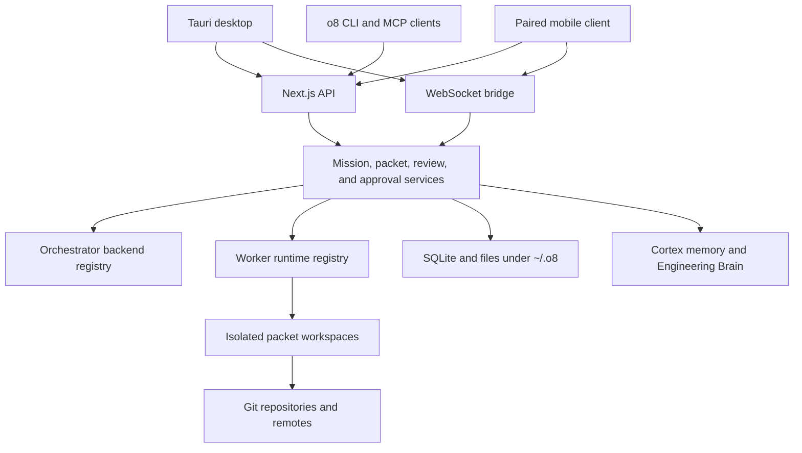

# System architecture

o8 is a local-first control plane above interchangeable orchestrator backends and worker runtimes. The control plane owns scope, state, review, approval, and audit; provider adapters own execution details.

## Process model

The Tauri shell packages the web frontend and launches the local Next.js server and standalone WebSocket bridge. The packaged shell selects ports dynamically and writes the active values under `~/.o8`; callers resolve those values instead of assuming development ports.

## Orchestration and execution

Orchestrator backends live under `src/lib/lane/orchestrator-backends/`. They decide which system plans and drives an orchestration turn.

Worker runtime adapters live under `src/lib/runtimes/`. They normalize discovery, launch, resume, interrupt, transcript, cost, and review capabilities for installed agent CLIs.

These registries are deliberately independent. An OpenClaw or Claude orchestrator may dispatch a Codex, Gemini, Cursor, or other registered worker without changing packet semantics.

## Work isolation and integration

A packet is the durable unit of scoped work. Each execution attempt creates a lane and normally runs in an isolated git worktree or another registered workspace provider. The workspace contains file mutations; the control plane stores lifecycle, review, approval, and recovery state outside it.

Integration is gated through review and principal-aware approval. A worker can request merge approval, but worker context cannot grant itself operator authority.

## State and memory

SQLite and file-backed stores under `~/.o8` hold lanes, events, approvals, projects, runtime sessions, terminal state, and other local control-plane records. `CORTEX_IDE_DATA_DIR` redirects this state for tests and isolated installations.

Cortex indexes repository documentation and completed outcomes, then exposes cited retrieval through the Engineering Brain. Memory can inform a decision, but it does not bypass the current repository state or approval gates.

## Transport and trust boundaries

The Next.js API is default-deny. Loopback identity, bearer credentials, paired-device capabilities, origins, and self-authenticating public routes are evaluated explicitly. The WebSocket bridge applies the corresponding authentication and channel ownership rules for realtime traffic.

Read the [loopback API model](loopback-api.md) for authorization rules, the [API reference](api.md) for route families, and the [connect contract](connect-contract.md) for the remote relay wire protocol.

## Extension points

- Add a worker through the [runtime adapter contract](runtime-adapter-contract.md).
- Add or change a public route through the API middleware and real-path route tests.
- Add a cross-process protocol only with an entry-point test that proves the production caller reaches persisted behavior.
- Add operator actions through the shared control-plane services so the app, CLI, and MCP surfaces remain symmetric.
