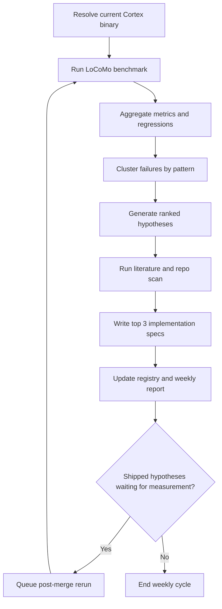

# Cortex AutoResearch Setup

## Goal

Set up a weekly agent-run research loop for Cortex Memory that turns LoCoMo benchmark failures into ranked improvement specs, then measures whether shipped work actually moved the benchmark.

This should borrow the useful parts of AutoResearchClaw's methodology:

- artifactized stages
- benchmark as a first-class pipeline step
- a `ship` / `refine` / `drop` decision after analysis
- cross-run lessons that inform the next run

This should **not** become a full autonomous research platform. The target here is a small, repeatable improvement engine for Cortex Memory.

## Why This Exists

The repo already has:

- a baseline LoCoMo benchmark in `docs/research/cortex-locomo-benchmark.md`
- a later merged rerun in `docs/research/cortex-combined-benchmark-2026-03-22.md`
- concrete improvement candidates in `docs/research/cortex-multi-hop-temporal-plan.md`

What is missing is the loop:

1. rerun benchmark automatically against the current Cortex binary
2. summarize the worst categories and failure modes
3. rank improvement ideas
4. scan literature and adjacent repos for fixes
5. write top implementation specs
6. rerun after merges and keep score across time

## Operating Principles

1. Keep the benchmark path deterministic.
   Benchmark import, scoring, and metric aggregation should be scripts, not free-form agent behavior.

2. Use the agent for synthesis, not for measurement.
   The agent should generate hypotheses, literature packets, and specs from structured artifacts that were produced deterministically.

3. Every stage writes machine-readable and human-readable output.
   If a stage does not leave behind a JSON artifact plus a markdown summary, it is not part of the loop yet.

4. Track lineage explicitly.
   Every hypothesis should point back to the benchmark run that created it, the spec that refined it, the issue/PR that implemented it, and the rerun that measured it.

5. Optimize for general Cortex quality, not benchmark gaming.
   Each spec must include product value beyond LoCoMo and avoid benchmark-only code paths.

## What To Copy From AutoResearchClaw

AutoResearchClaw's useful patterns for this setup are:

- per-run artifact folders with stable structure
- a dedicated benchmark/evaluation subsystem
- explicit stage outputs that can be resumed or re-read later
- a mid-pipeline decision of `proceed`, `refine`, or `pivot`
- cross-run lessons stored separately and injected into later runs

For Cortex, adapt that into a tighter loop:

- `benchmark`
- `analyze`
- `hypothesize`
- `literature`
- `propose`
- `measure again after ship`

Do not copy the 23-stage paper pipeline or multi-agent sprawl. Cortex only needs one bounded research loop.

## Weekly Loop



## Benchmark Contract

The benchmark stage should be stable enough that runs are comparable over time.

- Dataset: public LoCoMo `locomo10.json`
- Default scored slice: answerable questions, categories `1-4`
- Optional smoke slice: `conv-30`
- Modes: `bm25`, `hybrid`, `answer`, `ask`
- Fresh isolated Cortex DB per run
- Fixed scorer version per evaluator release
- Logged config for:
  - Cortex binary path
  - Cortex git SHA or binary version
  - embed model
  - reader model
  - import flags
  - search limit
  - dataset version
  - evaluator version

Important rule: if evaluator logic changes, bump an explicit `evaluator_version` and do not compare those runs as a clean trendline.

## Proposed Repo Layout

```text
config/
  research/
    cortex-autoresearch.yaml

scripts/
  research/
    run-cortex-autoresearch.ts
    resolve-cortex-binary.ts
    prepare-locomo.ts
    benchmark-locomo.ts
    analyze-locomo.ts
    generate-hypotheses.ts
    literature-scan.ts
    propose-specs.ts
    render-weekly-report.ts
    update-registry.ts

artifacts/
  research/
    cortex-autoresearch/
      registry.db
      lessons.jsonl
      runs/
        2026-03-22T230500Z-4da4d21/
          manifest.json
          benchmark/
          analysis/
          hypotheses/
          literature/
          proposals/
          report.md

docs/
  research/
    cortex-autoresearch/
      weekly/
      specs/
```

Raw run artifacts should live under `artifacts/research/` and be gitignored later. Distilled weekly summaries and approved specs should live under `docs/research/cortex-autoresearch/` and be committed.

## What Each Weekly Run Should Write

### Raw run folder

```text
runs/<run_id>/
  manifest.json
  benchmark/
    config.json
    import_log.txt
    results.json
    metrics.json
    failures.jsonl
  analysis/
    category_summary.json
    regressions.json
    failure_patterns.json
    worst_examples.md
  hypotheses/
    ranked.json
  literature/
    H001.json
    H001.md
    H002.json
    H002.md
  proposals/
    H001-spec.md
    H002-spec.md
    H003-spec.md
  report.md
```

### Committed outputs

- `docs/research/cortex-autoresearch/weekly/<run_id>.md`
- `docs/research/cortex-autoresearch/specs/H001-<slug>.md`
- optional later: `docs/research/cortex-autoresearch/index.md`

## Scripts And Harnesses

| Script | Purpose | Main output |
| --- | --- | --- |
| `scripts/research/run-cortex-autoresearch.ts` | Top-level weekly orchestrator. Runs each stage, assigns `run_id`, updates registry. | Full run folder + weekly report |
| `scripts/research/resolve-cortex-binary.ts` | Resolves the benchmark target. Either uses a configured binary path or builds from a configured Cortex repo/ref. Captures SHA/version. | `manifest.json` binary metadata |
| `scripts/research/prepare-locomo.ts` | Downloads or validates LoCoMo, materializes the markdown corpus in the benchmark format used by prior notes, and records dataset version. | Prepared corpus + dataset manifest |
| `scripts/research/benchmark-locomo.ts` | Creates a fresh DB, imports corpus, waits for embeddings if needed, runs configured retrieval/synthesis modes, and scores all questions. | `benchmark/results.json`, `metrics.json`, `failures.jsonl` |
| `scripts/research/analyze-locomo.ts` | Produces category tables, regression deltas vs the prior baseline, and clustered failure patterns. | `analysis/category_summary.json`, `failure_patterns.json`, `worst_examples.md` |
| `scripts/research/generate-hypotheses.ts` | Reads benchmark + analysis artifacts and outputs ranked, structured hypotheses. | `hypotheses/ranked.json` |
| `scripts/research/literature-scan.ts` | For each top failure pattern, gathers papers, repos, and techniques from arXiv/OpenAlex/Semantic Scholar/GitHub and writes annotated notes. | `literature/H###.json`, `literature/H###.md` |
| `scripts/research/propose-specs.ts` | Turns the top 3 ranked hypotheses into implementation specs with code seams, tests, rollout plan, and success gates. | `proposals/H###-spec.md` |
| `scripts/research/render-weekly-report.ts` | Collapses the run into a short operator report and a committed markdown summary. | `report.md` + `docs/.../weekly/<run_id>.md` |
| `scripts/research/update-registry.ts` | Inserts run, metric, hypothesis, spec, and measurement lineage into SQLite. | `registry.db` |

## Analysis Stage Design

The analysis stage should not only print scores. It should answer: "what is broken, how often, and where should we spend the next week?"

### Category analysis

Compute at least:

- F1 / EM by category for `answer` and `ask`
- top-1 / top-5 / recall / answer-hit by category for retrieval modes
- latency by mode
- regression vs prior accepted baseline

### Failure pattern taxonomy

Start with a fixed tag set derived from the current benchmark notes:

- `exact_turn_missing`
- `one_hop_only`
- `temporal_unanchored`
- `answer_form_paraphrase`
- `citation_integrity_failed`
- `hybrid_latency_too_high`

Use a two-pass analyzer:

1. deterministic rules first
   - missing cited evidence
   - wrong date format
   - one cited snippet for a multi-evidence question
   - degraded `ask` response with integrity failure
2. agent clustering second
   - read the worst examples and collapse them into reusable failure patterns

This keeps the failure analysis grounded in measurable artifacts while still letting the agent produce higher-level summaries.

## Hypothesis Stage Design

The hypothesis generator should emit structured records, not prose blobs.

Suggested fields:

- `hypothesis_id`
- `origin_run_id`
- `title`
- `failure_pattern_ids`
- `mechanism`
- `expected_metric_gain`
- `expected_categories_helped`
- `confidence`
- `effort`
- `latency_risk`
- `overfit_risk`
- `product_value_beyond_locomo`
- `decision`: `ship` / `refine` / `drop`

### Ranking rule

Use a simple ranking score so the loop is stable:

`priority = expected_gain * confidence * product_value / effort`

Then apply hard penalties for:

- high overfit risk
- large latency regression risk
- benchmark-specific code paths

This prevents the weekly loop from always picking the most benchmark-local hack.

## Literature Stage Design

Each top failure pattern should get a short research packet with:

- `3-5` relevant papers
- `2-3` relevant repos or production systems
- one "what to steal"
- one "what not to steal"
- one Cortex-specific applicability note

Recommended sources:

- arXiv
- OpenAlex
- Semantic Scholar
- GitHub

The output should be structured first and narrative second:

- machine-readable JSON for titles, URLs, years, abstracts, and relevance
- markdown summary for operator reading

## Proposal Stage Design

The top 3 hypotheses each become a concrete implementation spec.

Each spec should include:

- problem statement
- benchmark evidence from the current run
- why this should help beyond LoCoMo
- likely code seams in the `hurttlocker/cortex` repo
- minimal implementation plan
- tests required
- rollout flag or isolation strategy
- success criteria
- no-go criteria
- exact rerun plan after merge

This step is where the loop stops being "research notes" and becomes an actionable engineering queue.

## Where Benchmark Results Accumulate

Use a two-tier storage model.

### Tier 1: raw artifacts

Location:

- `artifacts/research/cortex-autoresearch/runs/<run_id>/`

Use this for:

- raw benchmark output
- question-level failures
- regression tables
- literature scan payloads
- generated proposals

This is the source of truth for machine analysis.

### Tier 2: durable registry

Location:

- `artifacts/research/cortex-autoresearch/registry.db`

Use this for:

- run index
- metrics over time
- hypothesis lineage
- implementation links
- post-ship measurements

This is the source of truth for cross-run tracking.

### Tier 3: committed summaries

Location:

- `docs/research/cortex-autoresearch/weekly/`
- `docs/research/cortex-autoresearch/specs/`

Use this for:

- operator-readable summaries
- approved specs
- research history worth keeping in git

## How To Track Hypothesis -> Implementation -> Measured Result

Use a small SQLite lineage model.

### Required tables

| Table | Purpose |
| --- | --- |
| `runs` | One row per weekly or post-merge run. Stores `run_id`, trigger, binary SHA, dataset version, evaluator version, status. |
| `metrics` | One row per metric per run, split, mode, and category. |
| `failures` | Question-level outcomes and assigned failure tags. |
| `hypotheses` | Ranked ideas generated from a run, with decision and expected gain fields. |
| `literature_refs` | Papers/repos linked to a hypothesis. |
| `specs` | Generated implementation specs and approval state. |
| `implementations` | GitHub issue, PR, merged SHA, and merge date linked back to a hypothesis. |
| `measurements` | Before/after comparison tying a shipped implementation to the rerun that measured it. |
| `lessons` | Cross-run warnings and heuristics that should be fed into later prompts. |

### Hypothesis lifecycle

`new -> ranked -> spec_written -> approved -> in_progress -> shipped -> rebench_queued -> measured -> archived`

### Linking conventions

Use one explicit ID everywhere:

- hypothesis ID: `H###`
- spec filename: `H###-<slug>.md`
- issue title prefix: `[H###]`
- PR body footer: `Hypothesis: H###`

That is enough for the agent to join benchmark artifacts to shipped code later.

## Cross-Run Lessons

Borrow AutoResearchClaw's "lessons" idea, but keep it small.

Store a `lessons.jsonl` file with entries like:

- evaluator pitfalls
- recurring false-positive failure tags
- benchmark setup bugs
- ideas that looked promising but did not move the score
- ideas that improved LoCoMo but regressed latency or product quality

These lessons should be injected into:

- hypothesis prompts
- literature prompts
- spec-writing prompts

This prevents the loop from rediscovering the same dead ends every week.

## Minimum Infrastructure

This can be self-sustaining with very little infrastructure:

1. One runner.
   A self-hosted machine with Node 22, access to the Cortex repo or binary, access to model keys, and enough disk for benchmark artifacts.

2. One scheduler.
   Prefer a GitHub Actions workflow with `schedule` and `workflow_dispatch` on a self-hosted runner. If that is not ready yet, use `launchd` or `cron` on the same machine and call the exact same CLI entrypoint.

3. One registry.
   A local SQLite file under `artifacts/research/cortex-autoresearch/registry.db`.

4. One artifact tree.
   Stable run folders under `artifacts/research/cortex-autoresearch/runs/`.

5. One agent-capable synthesis layer.
   Any agent or LLM surface that can consume JSON artifacts and emit structured markdown/JSON for hypotheses, literature, and specs.

Not required for v1:

- a dashboard
- a separate database service
- multiple benchmark suites
- issue auto-filing
- full autonomy on code changes

## Recommended Automation Surface

Add package scripts once the harness exists:

```json
{
  "research:weekly": "tsx scripts/research/run-cortex-autoresearch.ts --trigger weekly",
  "research:bench": "tsx scripts/research/benchmark-locomo.ts",
  "research:analyze": "tsx scripts/research/analyze-locomo.ts",
  "research:post-merge": "tsx scripts/research/run-cortex-autoresearch.ts --trigger post-merge"
}
```

Then add one workflow later:

- `.github/workflows/research-weekly.yml`

Recommended triggers:

- weekly cron for the full loop
- `workflow_dispatch` for manual reruns
- post-merge rerun when a PR merged with a `Hypothesis: H###` footer

## Weekly Operator Flow

1. Run `research:weekly`.
2. Benchmark current Cortex binary against LoCoMo.
3. Compare against the last accepted baseline.
4. Tag and cluster the worst failures.
5. Rank hypotheses.
6. Build literature packets for the strongest ones.
7. Write top 3 specs.
8. Commit the weekly summary and approved specs.
9. If a linked hypothesis was shipped since the last run, schedule or run `research:post-merge`.

This makes the loop continuous instead of a pile of disconnected research notes.

## Incremental Build Order

### Phase 1: measurement backbone

Build first:

- `prepare-locomo.ts`
- `resolve-cortex-binary.ts`
- `benchmark-locomo.ts`
- `update-registry.ts`
- `render-weekly-report.ts`

Goal:

- every weekly run produces stable metrics and a committed markdown summary

### Phase 2: diagnosis

Build next:

- `analyze-locomo.ts`
- fixed failure taxonomy
- baseline/regression comparison

Goal:

- weekly run says what failed, not just how much

### Phase 3: synthesis

Build next:

- `generate-hypotheses.ts`
- `literature-scan.ts`
- `propose-specs.ts`
- `lessons.jsonl` injection

Goal:

- weekly run ends with top 3 concrete specs

### Phase 4: closed loop

Build last:

- scheduled workflow
- post-merge rerun trigger
- implementation linkage via hypothesis IDs

Goal:

- each shipped improvement gets measured and fed back into the next cycle

## Bootstrap From Current Cortex Research

The first version does not need to start from zero. Seed the initial taxonomy and lesson store from the current docs:

- temporal normalization / anchoring
- multi-hop retrieval / evidence composition
- answer-form discipline
- citation integrity failures in `ask`
- hybrid latency tradeoffs

The existing benchmark and plan docs already show that these are real failure families. The automation should formalize them, not rediscover them manually each time.

## Recommendation

Build this as a repo-local research subsystem, not as a separate service.

The minimum viable stack is:

- one benchmark harness
- one SQLite registry
- one artifact tree
- one weekly orchestrator
- one post-merge rerun path
- one spec writer

That is enough to make Cortex Memory improvement measurable, repeatable, and compounding.

## References

- AutoResearchClaw README: https://github.com/aiming-lab/AutoResearchClaw
- LoCoMo repo: https://github.com/snap-research/locomo
- LoCoMo paper: https://aclanthology.org/2024.acl-long.747/
- Existing Cortex benchmark baseline: `docs/research/cortex-locomo-benchmark.md`
- Existing Cortex merged rerun: `docs/research/cortex-combined-benchmark-2026-03-22.md`
- Existing Cortex improvement plan: `docs/research/cortex-multi-hop-temporal-plan.md`
