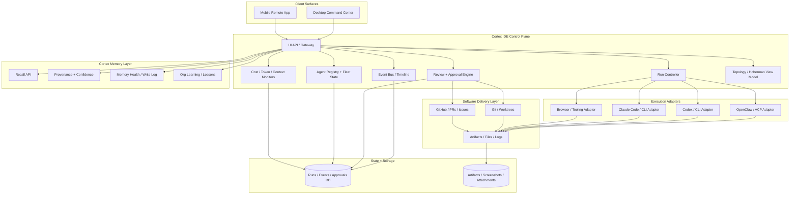

# System Architecture — Cortex IDE

## Architectural stance

Cortex IDE should be built as a **control plane above existing runtimes**, not as a monolithic editor-first stack.

That means:

- **Cortex** provides memory, recall, provenance, and organizational learning
- **OpenClaw / ACP / agent runtimes** provide execution
- **Git / GitHub / worktrees / terminals** provide delivery surfaces
- **Cortex IDE** provides the operator experience and orchestration layer
- **Mobile** acts as a paired remote control surface

## Where everything sits

### Cortex
Cortex is the **memory substrate**.

Responsibilities:
- recall
- provenance
- memory health
- org-level learning
- agent continuity
- decision replay inputs

### OpenClaw / ACP / runtime adapters
These are the **execution substrate**.

Responsibilities:
- spawn sessions
- steer sessions
- observe run state
- attach tools
- expose logs and artifacts

### Paperclip
Paperclip is **inspiration and optional grammar**, not the core product.

Useful borrowable ideas:
- company / org framing
- agent / issue / status primitives
- internal operating shell language

Not recommended as the full base product thesis.

### Git / GitHub / worktrees
These are the **delivery and review substrate**.

Responsibilities:
- branch and worktree state
- diffs
- PR review queue
- issue references
- artifact traceability

### Mobile relay / paired app
This is the **remote operations surface**.

Responsibilities:
- notifications
- approvals
- quick steering
- live run watch
- Cortex search / incident context

## High-level diagram

## Core subsystems

### 1. UI API / Gateway
The single ingress point for desktop and mobile clients.

Responsibilities:
- auth and sessions
- role-aware response shaping
- live subscriptions
- routing operator actions to orchestration services

### 2. Fleet state service
Maintains the truth about:
- agents
- squads
- runtimes
- states
- ownership
- health
- recent activity

### 3. Run controller
Controls session lifecycle:
- spawn
- attach
- pause
- stop
- steer
- retry
- reroute

### 4. Review + approval engine
Unifies:
- approval requests
- PR state
- diff summaries
- rollback previews
- operator responses

### 5. Event bus / timeline
Captures everything important in order:
- task starts
- tool events
- errors
- approvals
- memory writes
- diffs
- PRs
- completions

This becomes the backbone of auditability.

### 6. Topology / Hoberman view model
This is not just decorative UI.
It must compress system complexity into meaningful layers:

- **collapsed** → org health, budgets, incidents, throughput
- **mid expansion** → squads, queues, worktrees, memory clusters
- **fully expanded** → individual agents, tasks, diffs, run state, alerts

## Mobile architecture recommendation

Use the Remodex-style insight:

- heavy execution stays on Mac / desktop / server
- phone is a remote control surface
- pairing should be fast and local-first
- secure relay can exist, but local/self-hosted path should remain viable

Recommended flow:

1. Desktop control service generates pairing session
2. Phone scans QR and establishes trust
3. Mobile app receives notifications and subscribes to operator-safe events
4. Mobile can send steer / approve / deny / pause / resume actions
5. Sensitive payloads use authenticated encrypted transport

## Security model

Minimum security posture:

- device pairing and identity
- encrypted transport for mobile control
- operator approvals for risky actions
- scoped permissions per runtime / repo / workspace
- audit log for all mutations
- secret handling outside the UI layer

## Recommended deployment model

### Phase 1
Single-operator local-first deployment.

- control service runs on operator machine or one trusted host
- runtimes mostly local
- Cortex local or privately hosted
- mobile via paired relay

### Phase 2
Small-team private hosted deployment.

- shared fleet state
- multiple operators
- role-aware access
- richer audit + policy

## Build recommendation

### Build first
- control plane
- runtime adapters
- memory surfaces
- mobile pairing + notifications

### Build later
- full editor shell
- multi-tenant public cloud product
- broad extension ecosystem

## Strategic conclusion

Cortex IDE should treat:

- **Cortex** as the memory operating system
- **OpenClaw / runtimes** as execution engines
- **GitHub/Git** as the external software delivery graph
- **mobile** as a first-class control surface
- **Paperclip** as borrowable grammar, not the full product core
